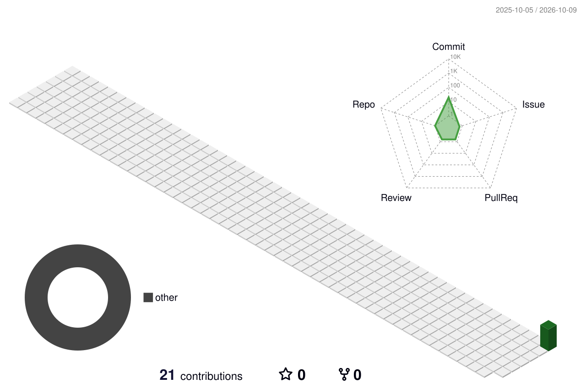

<div align="center">


<a href="https://github.com/USERNAME">
  
</a>

<br/>


</div>

<br/>


## `> whoami`

```ansi
[1;36m┌──────────────────────────────────────────────────────────┐[0m
[1;36m│[0m  [1;35mNAME[0m      : Rizki                                          [1;36m│[0m
[1;36m│[0m  [1;35mROLE[0m      : Full-Stack Developer                           [1;36m│[0m
[1;36m│[0m  [1;35mFOCUS[0m     : Laravel, Industrial and Internal Web Systems   [1;36m│[0m
[1;36m│[0m  [1;35mSTACK[0m     : PHP, SQL Server, JavaScript, SCSS              [1;36m│[0m
[1;36m│[0m  [1;35mMISSION[0m   : Turn messy workflows into clean software       [1;36m│[0m
[1;36m└──────────────────────────────────────────────────────────┘[0m
```

- ⚡ Building web applications for manufacturing and production environments
- 🧠 Deep experience in Laravel with SQL Server, admin dashboards, and component-based SCSS
- 🎯 Focused on performance, clean architecture, and interfaces people actually enjoy using
- 📡 Currently exploring modern frontend tooling and better developer workflows


## `> load tech_stack --neon`

<div align="center">


<br/><br/>


</div>


## `> run github_stats --cyberpunk`

<div align="center">


<br/>


</div>


## `> render contribution_matrix --3d`

<div align="center">

<picture>
  <source media="(prefers-color-scheme: dark)" srcset="./profile-3d-contrib/profile-night-rainbow.svg" />
  
</picture>

<br/><br/>


</div>


## `> list featured_projects`

<table>
<tr>
<td width="50%" valign="top">

### 🏭 Production Planning Suite
`Laravel` `SQL Server` `Chart.js`

Web system for line planning and capacity calculation, with real-time formulas and printable PDF reports.

<a href="https://github.com/USERNAME/REPO_NAME"></a>

</td>
<td width="50%" valign="top">

### ⚙️ Machine Monitoring Tool
`Laravel` `SCSS` `Vite`

Tracking dashboard for machine usage with clean component-based styling and sync to existing data sources.

<a href="https://github.com/USERNAME/REPO_NAME"></a>

</td>
</tr>
<tr>
<td width="50%" valign="top">

### 🧩 Workforce Competency Platform
`Laravel` `Multi-Role Auth` `Excel Import`

Role-based management system with approval workflows and bulk data import.

<a href="https://github.com/USERNAME/REPO_NAME"></a>

</td>
<td width="50%" valign="top">

### 🚀 Side Project
`Your Stack Here`

Short description of an independent project you want to highlight.

<a href="https://github.com/USERNAME/REPO_NAME"></a>

</td>
</tr>
</table>


## `> open comms_channel`

<div align="center">

<a href="https://www.linkedin.com/in/USERNAME"></a>
<a href="mailto:EMAIL@DOMAIN.COM"></a>
<a href="https://instagram.com/USERNAME"></a>
<a href="https://github.com/USERNAME"></a>

<br/><br/>


<br/>


</div>
